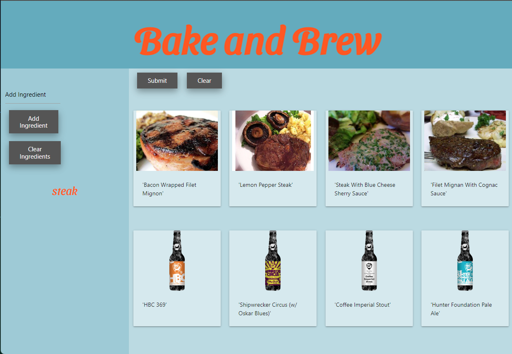

# <Bake and Brew>

## Use ingredients you have to get ideas for meals you can make with them.

As developers, we wanted to create a Web App that will allow people to get recipe ideas based on the ingredients in their homes and suggest a beer paring.

## User Story

As a user,\
WHEN I input the ingredients that I have,\
THEN a list is created of those ingredients and stored locally.\
WHEN the "Clear Ingredient" button is clicked,\
THEN the ingredient list is cleared.\
WHEN I click submit,\
THEN recipe cards are generated from the ingredient list, with a beer to accompany them.\
WHEN I click on the recipe I choose,\
THEN I am taken to a new tab that gives me the recipe.\
WHEN the "Clear" button is clicked,\
THEN the recipe list is cleared.

## Repository and Deployed webpage

https://github.com/ScrimmyFS/Bake-n-brew \
https://scrimmyfs.github.io/Bake-n-brew/

## Demo

## Usage

> * Type an ingredient in the ingredient field in the left sidebar.
> * Click "Add Ingredient" or tap the "enter" key.
> * Click the submit button in the main window.
> * Select a recipe card and you are taken to a new tab with that recipe.

## Credits

Developed by:
> * Dylan Scrimshaw
> * Lucas Bielinski
> * James Horton
> * Reed Martin

## Resources

### APIs
> * [Spoonacular](https://spoonacular.com/food-api/docs)
> * [Punk API](https://punkapi.com/documentation/v2)

### Framework
> * [Materialize](https://materializecss.com/)